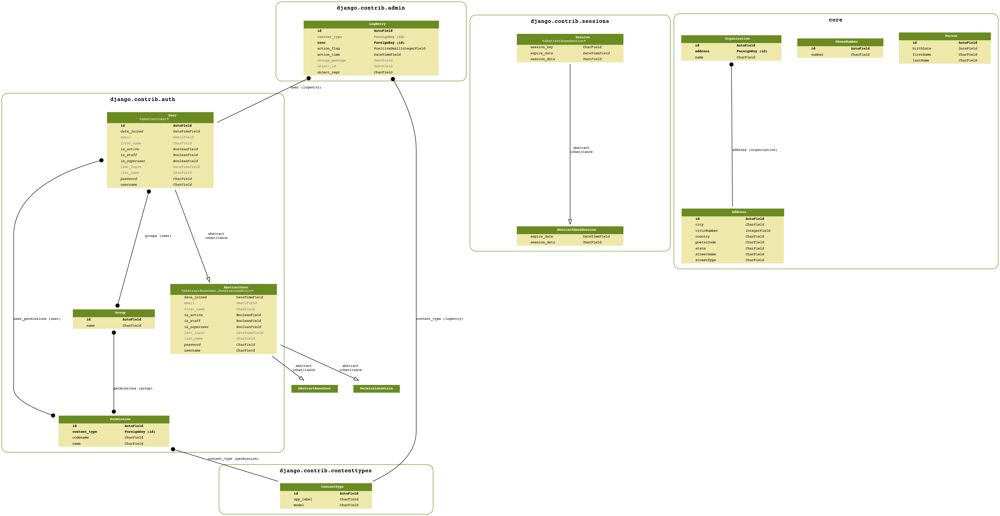

# Neural Résumé

Neural Résumé is a web app dedicated to produce, manage and share your metadata about project and work contributions.

In today's collaborative and open source development,
we have a lot of platforms and tools aimed to increase our productivity and to manage projets.
All these tools produce metadata that reflex the working effort and contributions.

But its still difficult to an end user, individuals or a corporation, to 

## Use cases

### Corporative Résumé

An employee already take a lot of time working on his project, tracking issues and filling timesheets. He do not want to waste time to update its Résumé.
More over if it must be produce with a tool imposed by the RH guys.

### Project Post-mortem or sprint evaluation

You just finished a tought sprint rush and all you want to do is to go ahead and start another sprint on a cool feature your client is eager to see implemented.
Or maybe its a half year long project that just ended. One day or another you have to dig into the project history to remember what happened and make sense of it. Or maybe just continue and lost the project knowledge!

### Agile team showcase

You want to demonstrate than your team is skilled, complete and can provide all the technical capacity needed by a client.

## Design Principles

### Projet Metadata is valuable

The goal of a project is to produce something valuable. Usually, its a product, a piece of softweare or a service that helped a client to achieve its goals. 
Projet metadata as time taken to realise a task or technical skills acquired to achieve a task are not considered as something that she should seriously manage.

We do not share this thought and consider project metadata as a valuable information from which teams and individuals could create bussiness value.

### User Context must be our primary concern

This tool - as any other - should add value but no overhead. 
It should integrate easilly and seemlessly with users usual working workflow.

We a favor any minor solution that really help users in its day to day work than a big infrastructure setup capable of solving all problems in an organisation.

### Open Teams are better than isolated individuals

Today's big projects have help create a collaborative culture and an enthousiasm about sharing code and data.
But project management informations are still kept private and are difficult to share. 

We think sharing management metadata informations will be beneficial to collaborations and help teams focus on their primary goals.

## Use cases

### Corporative Résumé

An employee already take a lot of time working on his project, tracking issues and filling timesheets. He do not want to waste time to update its Résumé.
More over if it must be produce with a tool imposed by the RH guys.

### Project Post-mortem or sprint evaluation

You just finished a tought sprint rush and all you want to do is to go ahead and start another sprint on a cool feature your client is eager to see implemented.
Or maybe its a half year long project that just ended. One day or another you have to dig into the project history to remember what happened and make sense of it. Or maybe just continue and lost the project knowledge!

### Agile team showcase

You want to demonstrate than your team is skilled, complete and can provide all the technical capacity needed by a client.

## Dependencies

  - docker
  - docker-compose

## Configuration

    cp .env.example .env

Set variables in `.env`. test ho!
 
## Application startup

    docker-compose up

# Graph of Data Models

